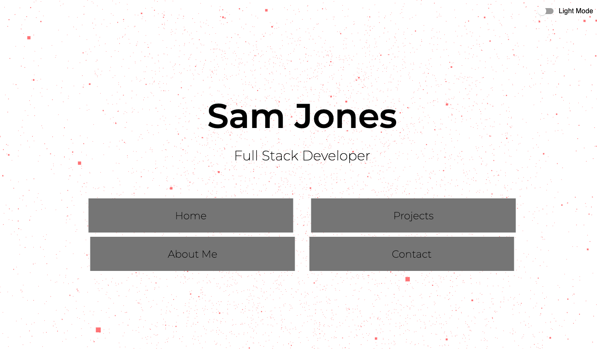

## tech_blog

## URL

https://particularspace.github.io/sam_portfolio/

## Description

This is my personal portfolio showcasing my skills as a Full Stack Developer. It includes a range of projects I've worked on, my technical skills, and ways to get in touch with me.

## Table of Contents

- [Features](#features)
- [Technologies](#technologies)
- [Images](#images)
- [Credits](#credits)
- [License](#license)
- [Tests](#tests)
- [Questions](#questions)

## Features

- Dark Mode
- Interactive UI
- Responsive
- Project Showcase
- Skills Section
- Contact Information

## Technologies

- React
- TypeScript
- Material UI
- Tailwind CSS
- Three.js
- Styled-components
- React Spring

## Images

## Credits

Sam Jones

## License

This project is licensed under the MIT license. To learn more please visit https://choosealicense.com/licenses/mit/

## Tests

N/A

## Questions

If you have any questions about the repo, open an issue or contact me directly at [samejones2018@gmail.com](mailto:samejones2018@gmail.com). You can find more of my work at [ParticularSpace](https://github.com/ParticularSpace).
